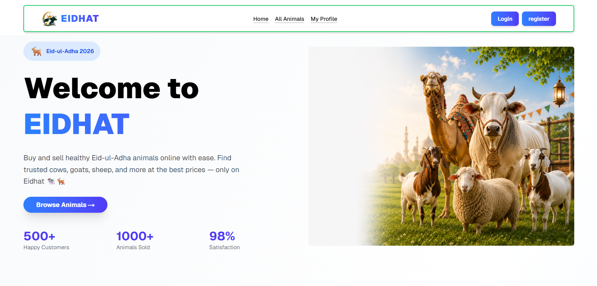

# 🐄 EIDHAT

> A modern Qurbani animal booking platform built with Next.js 🚀

---

## 📌 Purpose

EIDHAT is a modern and user-friendly Qurbani animal booking platform where users can easily browse animals, view detailed information, and book their preferred animal online.

---

## 🌐 Live Website

🔗 https://eid-hat.vercel.app/

---

## ✨ Key Features

- ✅ Browse animals with a modern experience  
- ✅ View full information about each animal  
- ✅ Modern and responsive UI  
- ✅ Secure user authentication  
- ✅ Easy booking form system  
- ✅ Profile update functionality  
- ✅ Loading skeletons for better UX  
- ✅ Fully mobile responsive navigation  

---
## 🛠️ Tech Stack

- ⚡ Next.js
- 🎨 Tailwind CSS
- 🧩 HeroUI
- 🍃 MongoDB
- ▲ Vercel

---

## 📦 NPM Packages Used

```bash
nextjs
tailwindcss
@heroui/react
react-hot-toast
@gravity-ui/icons
better-auth
```

---

## 📁 Project Structure

```bash
├── app
│   ├── page.jsx
│   ├── allanimals
│   ├── profile
│   ├── booking
│   └── api
│
├── components
│   ├── Navbar.jsx
│   ├── Footer.jsx
│   ├── Card.jsx
│   └── LoadingSkeleton.jsx
│
├── public
│   ├── images
│   └── animal.json
│
├── lib
│   └── auth-client.js
│
├── styles
│   └── globals.css
│
└── package.json
```

---

## 🖼️ Website Preview



---

## 👨‍💻 Author

➡️ Md Siddik
